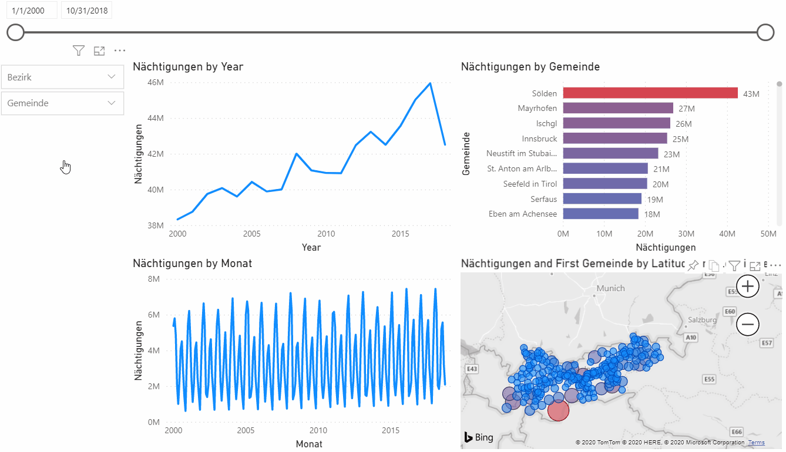

# tourismus-tirol

This repository represents an analysis of the development of tourism in Tyrol from 2000 to 2018.

[data source](https://www.tirol.gv.at/statistik-budget/statistik/tourismus/)

[Idea for the project](https://towardsdatascience.com/tourism-trends-in-europe-which-european-countries-are-overrun-with-tourists-f60c860bd23a)
